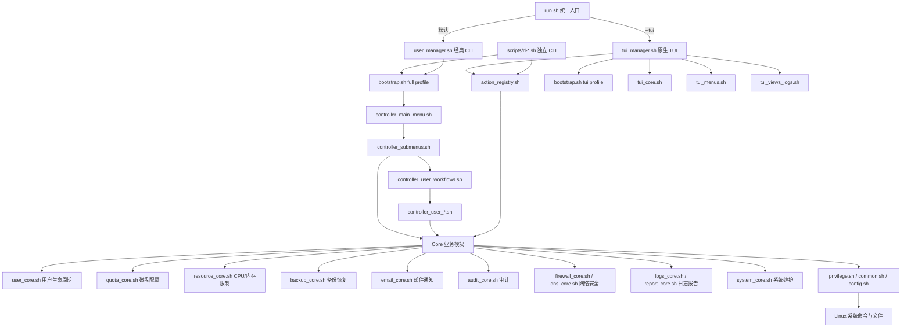

# Linux 多用户运维管理系统架构设计与功能说明

## 目录

- [1. 项目定位](#1-项目定位)
- [2. 设计目标](#2-设计目标)
- [3. 交互入口](#3-交互入口)
- [4. 总体架构](#4-总体架构)
- [5. 主执行路径](#5-主执行路径)
- [6. 核心模块](#6-核心模块)
- [7. 功能清单](#7-功能清单)
- [8. 独立 CLI 脚本](#8-独立-cli-脚本)
- [9. 典型业务流程](#9-典型业务流程)
- [10. 架构图](#10-架构图)
- [11. 架构特点](#11-架构特点)
- [12. 后续优化建议](#12-后续优化建议)

---

## 1. 项目定位

当前仓库是一个 **Bash/Shell 实现的 Linux 多用户运维管理系统**，主要面向 Ubuntu/Debian 多用户服务器环境。

项目目标是把服务器多用户场景中的常见运维任务集中到统一工具中，包括：

- 用户生命周期管理
- 用户组与权限管理
- 磁盘配额管理
- CPU/内存资源限制
- 备份与恢复
- 邮件通知
- 企业微信通知
- 网络与安全管理
- 日志、审计与报告
- 系统维护与监控

该项目更接近一个 **面向 Linux 服务器管理员的本地运维控制台**，而不是单一脚本工具。

---

## 2. 设计目标

### 2.1 统一多用户运维入口

将用户创建、删除、暂停、恢复、配额、资源限制、备份、审计等能力统一到一个管理系统中，减少管理员在多个命令和配置文件之间切换的成本。

### 2.2 同时支持交互式与自动化场景

项目同时提供：

- 经典 CLI 菜单，适合普通终端交互；
- 原生 Bash TUI，适合更直观的终端操作；
- 独立 CLI 脚本，适合自动化任务、定时任务和外部脚本调用。

### 2.3 复用业务核心能力

CLI、TUI 和独立脚本入口尽量复用同一套 Core 业务模块，避免相同能力在多个入口重复实现。

### 2.4 贴近系统原生命令

项目直接封装 Linux 系统能力，例如：

- `useradd` / `usermod` / `userdel`
- `passwd`
- `quota`
- `systemd` / `systemctl`
- `journalctl`
- `rsync`
- `ufw`
- `fail2ban`

---

## 3. 交互入口

项目提供三类主要入口。

| 入口类型 | 文件 | 说明 |
|---|---|---|
| 统一入口 | `run.sh` | 默认启动经典 CLI；传入 `--tui` 启动 TUI |
| 经典 CLI 菜单 | `user_manager.sh` | noTUI/CLI 主菜单入口 |
| 原生 Bash TUI | `tui_manager.sh` | 终端图形化菜单入口 |
| 独立命令脚本 | `scripts/rl-*.sh` | 面向自动化、脚本化调用 |

> 注意：当前 `run.sh` 默认进入 `user_manager.sh`。只有传入 `--tui` 时，才进入 `tui_manager.sh`。
>
> 如果其他文档中存在“默认启动 TUI”的描述，应以 `run.sh` 的实际行为为准。

---

## 4. 总体架构

项目整体采用分层架构：

```text
入口层
  ↓
启动加载层
  ↓
UI / Controller 层
  ↓
Action 分发层
  ↓
Core 业务层
  ↓
Privilege / System 基础层
  ↓
Linux 系统命令与文件
```

### 4.1 分层职责

| 层级 | 职责 |
|---|---|
| 入口层 | 选择 CLI、TUI 或独立脚本入口 |
| 启动加载层 | 统一加载配置、公共模块和业务模块 |
| UI 层 | 负责菜单、界面绘制、输入输出 |
| Controller 层 | 编排交互流程，例如收集参数、确认操作、进入子菜单 |
| Action 分发层 | 为 CLI/TUI/脚本提供统一动作 ID 和分发能力 |
| Core 业务层 | 执行用户、配额、备份、邮件、审计等核心逻辑 |
| 基础层 | 封装权限、配置、环境检测、日志、安全执行 |
| 系统层 | 调用 Linux 系统命令、读写系统配置和业务数据文件 |

### 4.2 核心设计思想

项目的核心设计思想是：

> **入口可以多样，业务能力应尽量统一。**

因此，TUI、经典 CLI 和独立脚本不应各自实现一套业务逻辑，而应尽量通过 `action_registry.sh`、Controller 和 `*_core.sh` 复用相同能力。

---

## 5. 主执行路径

### 5.1 经典 CLI 路径

```text
run.sh
  ↓
user_manager.sh
  ↓
lib/bootstrap.sh
  ↓
um_load_profile full
  ↓
lib/controller_main_menu.sh
  ↓
lib/controller_submenus.sh
  ↓
lib/controller_user_workflows.sh
  ↓
lib/controller_user_*.sh
  ↓
lib/*_core.sh
```

经典 CLI 路径主要负责传统菜单式交互，适合在普通终端中逐步完成管理任务。

### 5.2 TUI 路径

```text
run.sh --tui
  ↓
tui_manager.sh
  ↓
lib/bootstrap.sh
  ↓
um_load_profile tui
  ↓
lib/tui_core.sh
  ↓
lib/tui_menus.sh
  ↓
lib/tui_views_logs.sh
  ↓
lib/action_registry.sh
  ↓
controller / core modules
```

TUI 路径负责终端可视化菜单、表格、输入框、状态栏、日志视图等。

### 5.3 独立 CLI 脚本路径

```text
scripts/rl-*.sh
  ↓
lib/bootstrap.sh
  ↓
um_load_profile full
  ↓
lib/action_registry.sh
  ↓
rl_action_run / action_run
  ↓
lib/*_core.sh
```

独立 CLI 脚本适合自动化调用，例如：

```bash
scripts/rl-user-list.sh
scripts/rl-user-create.sh
scripts/rl-user-quota.sh
scripts/rl-backup-run.sh
scripts/rl-audit-query.sh
```

---

## 6. 核心模块

### 6.1 启动与公共基础模块

| 模块 | 职责 |
|---|---|
| `lib/bootstrap.sh` | 统一模块加载入口，提供 `um_load_profile full\|tui` |
| `lib/common.sh` | 公共输出、输入验证、安全执行、菜单循环、缓存等能力 |
| `lib/config.sh` | 配置加载与默认配置 |
| `lib/env_core.sh` | 环境探测与能力判断 |
| `lib/privilege.sh` | root 权限与特权命令封装 |
| `lib/access_control.sh` | 访问控制 |
| `lib/privilege_cache.sh` | 权限相关缓存 |
| `lib/async_core.sh` | 异步执行基础能力 |
| `lib/proc_manager.sh` | 进程管理 |

### 6.2 UI 与菜单模块

| 模块 | 职责 |
|---|---|
| `lib/tui_core.sh` | 原生 Bash TUI 绘制框架 |
| `lib/tui_menus.sh` | TUI 菜单数据定义与渲染引擎 |
| `lib/tui_views_logs.sh` | TUI 日志视图 |
| `lib/ui_modern.sh` | 现代 CLI 颜色、样式、组件 |
| `lib/ui_menu_modern.sh` | 现代菜单 UI 组件 |
| `lib/controller_main_menu.sh` | 经典 CLI 主菜单控制器 |
| `lib/controller_submenus.sh` | 经典 CLI 子菜单控制器 |
| `lib/action_registry.sh` | CLI/TUI 共用动作注册与分发 |

### 6.3 用户管理模块

| 模块 | 职责 |
|---|---|
| `lib/user_core.sh` | 用户 CRUD、密码、暂停恢复、邮箱配置、组权限等 |
| `lib/controller_user_workflows.sh` | 用户工作流聚合控制器 |
| `lib/controller_user_listing.sh` | 用户列表与查看 |
| `lib/controller_user_passwords.sh` | 密码修改与轮换 |
| `lib/controller_user_password_change.sh` | 密码变更辅助 |
| `lib/controller_user_lifecycle.sh` | 删除、重命名、暂停、恢复等生命周期操作 |
| `lib/controller_user_provisioning.sh` | 用户创建与更新流程 |
| `lib/controller_user_provisioning_support.sh` | 用户创建辅助逻辑 |
| `lib/controller_user_limits.sh` | 用户配额与资源限制控制器 |
| `lib/controller_user_groups.sh` | 用户组管理 |
| `lib/controller_user_permissions.sh` | 用户权限管理 |
| `lib/controller_user_notifications.sh` | 用户通知相关流程 |

### 6.4 磁盘与资源限制模块

| 模块 | 职责 |
|---|---|
| `lib/quota_core.sh` | 磁盘配额查询、设置、统计、数据盘匹配 |
| `lib/resource_core.sh` | CPU/内存限制，基于 systemd cgroup v2 与 ulimit |
| `lib/report_core.sh` | 配额、资源、用户、日志等报告生成 |

### 6.5 备份恢复模块

| 模块 | 职责 |
|---|---|
| `lib/backup_core.sh` | 用户数据备份、恢复、定时任务、批量备份 |
| `lib/backup_verify.sh` | 备份校验 |
| `lib/backup_excludes.sh` | `rsync` 排除规则 |

### 6.6 邮件与通知模块

| 模块 | 职责 |
|---|---|
| `lib/email_core.sh` | 邮件模块兼容桥，聚合邮件相关子模块 |
| `lib/rl_mail_config.sh` | SMTP 配置加载与校验 |
| `lib/rl_mail_template.sh` | 邮件模板渲染 |
| `lib/rl_mail_sender.sh` | 邮件发送后端 |
| `lib/rl_mail_queue.sh` | 邮件队列 |
| `lib/rl_mail_events.sh` | 邮件事件封装 |
| `lib/rl_mail_audit.sh` | 邮件审计 |
| `lib/rl_wecom_bot_sender.sh` | 企业微信机器人通知 |
| `lib/email_daemon.sh` | 邮件后台处理能力 |
| `templates/email/*.html` | 邮件 HTML 模板 |

### 6.7 网络与安全模块

| 模块 | 职责 |
|---|---|
| `lib/firewall_core.sh` | UFW 防火墙、端口规则、服务模板 |
| `lib/dns_core.sh` | DNS 白名单、DNS 限制、批量应用、规则刷新 |
| `lib/security_baseline_core.sh` | SSH 安全基线、认证失败、fail2ban 管理 |
| `lib/network_stack_core.sh` | 网络栈诊断 |
| `lib/symlink_core.sh` | 用户符号链接、共享链接、断链清理 |

### 6.8 日志、审计与报告模块

| 模块 | 职责 |
|---|---|
| `lib/audit_core.sh` | 操作审计、审计查询、统计、轮转 |
| `lib/logs_core.sh` | 统一日志读取服务 |
| `lib/logs_presenter.sh` | 日志展示格式化 |
| `lib/journalctl_core.sh` | journald/systemd 日志读取 |
| `lib/tui_views_logs.sh` | TUI 日志查看界面 |
| `lib/report_core.sh` | HTML 报告、CSV 导出、异常检测、趋势分析 |

### 6.9 系统维护与监控模块

| 模块 | 职责 |
|---|---|
| `lib/system_core.sh` | 系统信息、内存、硬件、崩溃诊断、监控入口 |
| `lib/ubuntu_maintenance_core.sh` | APT 更新、重启需求、软件源、包状态摘要 |
| `lib/systemd_timer_core.sh` | systemd timer 安装、查看、删除、日志 |
| `lib/vm_core.sh` | 虚拟机状态与列表 |
| `lib/gpu_core.sh` | GPU 状态、设备、进程 |
| `lib/shell_config.sh` | Shell 配置 |
| `lib/miniforge_core.sh` | Miniforge 安装与配置 |
| `lib/lock_core.sh` | 锁机制 |

---

## 7. 功能清单

### 7.1 用户生命周期管理

支持功能：

- 创建用户
- 更新用户配置
- 删除用户
- 重命名用户
- 修改密码
- 密码轮换
- 暂停用户
- 恢复用户
- 检查过期暂停
- 查看托管用户
- 管理用户配置 JSON
- 管理用户邮箱配置
- 创建用户时可选安装 Miniforge

关键文件：

```text
lib/user_core.sh
lib/controller_user_lifecycle.sh
lib/controller_user_provisioning.sh
lib/controller_user_passwords.sh
scripts/rl-user-create.sh
scripts/rl-user-list.sh
```

### 7.2 用户组与权限管理

支持功能：

- 加入用户组
- 移出用户组
- 查看用户所属组
- 查看组成员
- 创建用户组
- 删除用户组
- 查看权限详情
- 设置主目录权限
- 设置主目录属组
- 授予管理员权限
- 移除管理员权限

关键文件：

```text
lib/controller_user_groups.sh
lib/controller_user_permissions.sh
lib/user_core.sh
lib/access_control.sh
lib/privilege.sh
```

### 7.3 磁盘配额管理

支持功能：

- 查看数据盘概览
- 查询用户磁盘配额
- 设置用户磁盘配额
- 解析配额输入
- 汇总有配额用户
- 生成配额报告

关键文件：

```text
lib/quota_core.sh
lib/controller_user_limits.sh
scripts/rl-user-quota.sh
lib/report_core.sh
```

### 7.4 CPU/内存资源限制

支持功能：

- 查询当前资源限制
- 设置 CPU 限制
- 设置内存限制
- 运行时应用限制
- 运行时重置限制
- 移除限制
- 查询 ulimit
- 设置 ulimit
- 移除 ulimit
- 按 Linux 用户组批量应用资源策略
- 查看进程资源使用

关键文件：

```text
lib/resource_core.sh
scripts/rl-user-resource.sh
```

### 7.5 邮件通知

支持功能：

- SMTP 配置加载
- SMTP 配置校验
- 邮件模板渲染
- 密码通知邮件
- 配额告警邮件
- 账户禁用通知
- 账户恢复通知
- 账户暂停通知
- 备份完成通知
- 邮件发送重试
- 邮件队列
- 邮件审计
- 企业微信机器人通知
- 测试邮件发送

关键文件：

```text
lib/email_core.sh
lib/rl_mail_config.sh
lib/rl_mail_template.sh
lib/rl_mail_sender.sh
lib/rl_mail_queue.sh
lib/rl_mail_events.sh
lib/rl_mail_audit.sh
lib/rl_wecom_bot_sender.sh
templates/email/*.html
scripts/rl-mail-test.sh
scripts/verify_email_config.sh
```

### 7.6 备份与恢复

支持功能：

- 查看备份状态
- 列出已备份用户
- 手动备份用户
- 全量备份
- 增量备份
- `rsync` 备份
- 备份排除规则
- 恢复用户数据
- 设置定时备份
- 取消定时备份
- 查看备份计划
- 批量备份所有用户
- 并行备份
- 批次记录
- 从批次恢复
- 备份校验
- 备份索引

关键文件：

```text
lib/backup_core.sh
lib/backup_verify.sh
lib/backup_excludes.sh
scripts/rl-backup-run.sh
```

### 7.7 网络与安全

支持功能：

- UFW 防火墙初始化
- 添加防火墙规则
- 删除防火墙规则
- 查看用户规则
- 查看端口使用情况
- 配置端口范围规则
- 使用服务模板
- DNS 白名单管理
- 启用 DNS 限制
- 移除 DNS 限制
- 批量应用 DNS 限制
- 刷新 DNS 规则
- 查看 SSH 安全基线摘要
- 查看最近认证失败
- 查看 fail2ban 状态
- 配置 sshd jail
- 列出 fail2ban jails
- 网络栈诊断
- 符号链接与共享链接管理

关键文件：

```text
lib/firewall_core.sh
lib/dns_core.sh
lib/security_baseline_core.sh
lib/network_stack_core.sh
lib/symlink_core.sh
```

### 7.8 日志、审计与报告

支持功能：

- 操作审计记录
- 审计日志查看
- 审计条件查询
- 审计统计分析
- 手动日志轮转
- journald 审计查看
- boot 日志查看
- 失败服务查看
- 指定服务近期日志查看
- 启动错误对比
- 系统日志文件 tail
- 认证失败日志查看
- HTML 系统报告
- 用户个人报告
- 配额报告
- 资源限制报告
- 操作趋势分析
- 异常检测
- 日志摘要
- 用户历史查询
- 日期范围查询
- CSV 导出
- 每周自动报告

关键文件：

```text
lib/audit_core.sh
lib/logs_core.sh
lib/logs_presenter.sh
lib/journalctl_core.sh
lib/tui_views_logs.sh
lib/report_core.sh
scripts/rl-audit-query.sh
```

### 7.9 系统维护与监控

支持功能：

- 系统信息概览
- 内存信息查看
- 硬件健康检查
- 系统日志分析
- Ubuntu APT 维护摘要
- 重启需求检查
- systemd timers 管理
- btop/htop/glances 监控入口
- 崩溃原因分析
- OOM 防护配置
- 网络信息显示
- 虚拟机列表与状态
- GPU 状态查看
- GPU 设备查看
- GPU 进程查看
- 系统概览独立脚本

关键文件：

```text
lib/system_core.sh
lib/ubuntu_maintenance_core.sh
lib/systemd_timer_core.sh
lib/vm_core.sh
lib/gpu_core.sh
scripts/rl-system-overview.sh
```

---

## 8. 独立 CLI 脚本

| 脚本 | 功能 |
|---|---|
| `scripts/rl-user-list.sh` | 列出所有托管用户 |
| `scripts/rl-user-create.sh` | 创建托管用户 |
| `scripts/rl-user-quota.sh` | 查询或设置用户磁盘配额 |
| `scripts/rl-user-resource.sh` | 查询、设置、重置、移除用户资源限制 |
| `scripts/rl-mail-test.sh` | 发送 SMTP 测试邮件 |
| `scripts/rl-backup-run.sh` | 触发指定用户备份 |
| `scripts/rl-audit-query.sh` | 查询审计日志 |
| `scripts/rl-system-overview.sh` | glances 系统概览包装 |
| `scripts/verify_email_config.sh` | 验证邮箱配置 |
| `scripts/check_sensitive_files.sh` | 敏感文件/密钥扫描 |
| `scripts/normalize_echo_output.sh` | 输出规范化辅助脚本 |

独立 CLI 脚本通常遵循统一结构：

```text
定位项目根目录
  ↓
source lib/bootstrap.sh
  ↓
um_load_profile full
  ↓
action_register_defaults_once
  ↓
rl_action_run <action-id> cli "$@"
```

---

## 9. 典型业务流程

### 9.1 创建用户流程

```text
用户选择创建用户
  ↓
controller_user_provisioning.sh 收集用户名、密码、目录等参数
  ↓
user_core.sh 创建 Linux 用户
  ↓
可选：quota_core.sh 设置磁盘配额
  ↓
可选：resource_core.sh 设置 CPU/内存限制
  ↓
可选：rl_mail_events.sh 发送通知邮件
  ↓
audit_core.sh 记录审计日志
```

### 9.2 日志查询流程

```text
用户在 TUI/CLI 中选择日志功能
  ↓
action_registry.sh 分发日志 action
  ↓
logs_core.sh / journalctl_core.sh 读取日志
  ↓
logs_presenter.sh 格式化日志内容
  ↓
tui_views_logs.sh 或 CLI 输出结果
```

### 9.3 备份流程

```text
用户触发备份
  ↓
backup_core.sh 判断用户和目录
  ↓
backup_excludes.sh 应用排除规则
  ↓
rsync 执行备份
  ↓
backup_verify.sh 校验备份结果
  ↓
rl_mail_events.sh 发送备份通知
  ↓
audit_core.sh 记录审计日志
```

---

## 10. 架构图



### 10.1 简版结构图

```text
run.sh
├── user_manager.sh
│   └── controller_*
│       └── *_core.sh
├── tui_manager.sh
│   ├── tui_core.sh
│   ├── tui_menus.sh
│   ├── tui_views_logs.sh
│   └── action_registry.sh
└── scripts/rl-*.sh
    └── action_registry.sh
        └── *_core.sh

基础层：
bootstrap.sh / common.sh / config.sh / privilege.sh / env_core.sh
```

---

## 11. 架构特点

### 11.1 优点

- **分层清晰**：入口、加载、控制器、动作分发、业务核心分离明确。
- **入口多样**：同时支持经典 CLI、TUI 和独立脚本。
- **Action 可复用**：`action_registry.sh` 让 TUI/CLI 共享业务动作。
- **功能覆盖完整**：覆盖多用户服务器常见运维场景。
- **适合自动化**：`scripts/rl-*.sh` 可以被 cron、CI、运维脚本直接调用。
- **贴近系统能力**：直接封装 Linux 用户、磁盘、systemd、rsync、UFW、fail2ban 等能力。

### 11.2 当前边界

- 项目主体是 Bash/Shell，适合贴近系统命令的本地运维场景。
- 业务能力依赖宿主机系统环境，例如 Linux 发行版、systemd、UFW、fail2ban、quota 等。
- TUI 与 CLI 共享部分业务能力，但仍需要保持入口层和业务层边界清晰，避免 UI 层直接承载核心逻辑。

---

## 12. 后续优化建议

### 12.1 文档优化

- 将本文作为 `docs/ARCHITECTURE.md` 长期维护。
- 为 `action_registry.sh` 补充 action ID 清单与调用示例。
- 为 `scripts/rl-*.sh` 补充统一使用说明。
- 在 README 中增加“架构文档”链接。

### 12.2 模块边界优化

- 统一 `email_core.sh` 与 `rl_mail_*.sh` 的命名边界。
- 明确 Controller 层与 Core 层职责：Controller 只做流程编排，Core 只做业务执行。
- 减少模块间隐式依赖，将共享配置和状态集中到更明确的配置层。

### 12.3 可维护性优化

- 统一错误码与返回码规范。
- 统一日志输出格式。
- 为关键业务函数补充注释和调用示例。
- 为创建用户、设置配额、资源限制、备份、审计查询等核心流程补充测试。

### 12.4 自动化与稳定性优化

- 为独立 CLI 提供稳定参数规范。
- 为自动化场景补充非交互模式约定。
- 对系统命令调用增加更明确的失败处理和回滚策略。
- 对备份、配额、资源限制等高风险操作增加 dry-run 能力。
